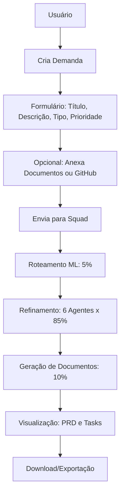

# Resumo Executivo: PRD AiChatFlow

## 📊 Visão Geral do Documento

**Título Completo:** PRD - AiChatFlow: Sistema de Refinamento de Demandas com IA
**Versão:** 1.0.0  
**Status:** Aprovado para Desenvolvimento
**Data:** 2024-07-25
**Complexidade:** Alto (Sistema completo com IA, ML e interface complexa)

## 🎯 Objetivos Principais

1. **Automatizar refinamento de demandas** - Reduzir tempo manual de 70%
2. **Garantir qualidade consistente** - 90% de aprovação sem revisão manual
3. **Fornecer interface intuitiva** - Score de satisfação ≥ 4.5/5
4. **Otimizar fluxo de trabalho** - Integração com GitHub e exportação flexível

## 🔢 Estatísticas do PRD

- **Requisitos Funcionais:** 10 (RF1-RF10)
- **Requisitos Não Funcionais:** 6 (RNF1-RNF6)
- **Tasks de Implementação:** 15 (T1-T15)
- **Componentes Principais:** 12 arquivos chave identificados
- **Agentes de IA:** 6 especialistas (Refinador, Scrum Master, QA, UX, Analista de Dados, Tech Lead)
- **Páginas do Documento:** 591 linhas

## 🎨 Componentes de Interface Principais

### 1. **DemandForm.tsx** - Formulário de Criação
- Campos: título, descrição, tipo, prioridade, anexos
- Integração GitHub
- Validação em tempo real
- Upload de documentos (PDF, TXT, DOCX)

### 2. **ChatArea.tsx** - Área de Processamento
- Visualização de mensagens por agente
- Barra de progresso (0-100%)
- Indicadores de status (⏳/✓/✗)
- Exportação (JSON/TXT/Copiar)
- Controle de interrupção

### 3. **HistorySidebar.tsx** - Histórico
- Lista de demandas com filtros
- Indicadores visuais de status
- Download direto de documentos
- Progresso para demandas em andamento

### 4. **DocumentViewer.tsx** - Visualizador
- Renderização Markdown
- Download PDF
- Estado expansível
- Indicadores de carregamento

### 5. **SquadMembers.tsx** - Informação da Squad
- Lista de 6 agentes ativos
- Status online/offline
- Descrição de papéis

## 🤖 Arquitetura de Backend

### Serviços Principais
1. **AISquadService** - Orquestração de agentes
2. **DemandRoutingOrchestrator** - Roteamento inteligente
3. **MLRouter** - Modelo de machine learning
4. **MistralAIService** - Integração com IA
5. **PDFGenerator** - Geração de documentos

### Fluxo de Processamento
```
[Demanda Criada] → [Roteamento ML (5%)] → [Refinamento Multi-Agente (85%)] → [Geração de Documentos (10%)] → [Concluído]
```

### Agentes de IA
1. **Refinador** - Captura e reformula demanda
2. **Scrum Master** - Analisa impacto e incrementos
3. **QA** - Identifica critérios de aceite
4. **UX Designer** - Avalia experiência do usuário
5. **Analista de Dados** - Verifica estrutura de dados
6. **Tech Lead** - Avalia viabilidade técnica
7. **Product Manager** - Gera PRD e Tasks finais

## 📋 Requisitos Funcionais Críticos

| ID | Requisito | Prioridade | Status |
|----|-----------|------------|--------|
| RF1 | Interface de criação de demandas | Alta | ✅ Documentado |
| RF2 | Processamento multi-agente | Alta | ✅ Documentado |
| RF3 | Roteamento inteligente | Alta | ✅ Documentado |
| RF4 | Visualização de chat em tempo real | Alta | ✅ Documentado |
| RF5 | Histórico de demandas | Alta | ✅ Documentado |
| RF6 | Visualização de documentos | Alta | ✅ Documentado |
| RF7 | Controle de processamento | Média | ✅ Documentado |
| RF8 | Exportação de diálogo | Média | ✅ Documentado |
| RF9 | Integração GitHub | Média | ✅ Documentado |
| RF10 | Sistema de notificações | Baixa | ✅ Documentado |

## ⚙️ Requisitos Não Funcionais

| ID | Requisito | Métrica |
|----|-----------|---------|
| RNF1 | Desempenho | < 2s carregamento, < 30s processamento |
| RNF2 | Segurança | Autenticação, validação, proteção XSS/CSRF |
| RNF3 | Compatibilidade | Chrome, Firefox, Safari, Edge, Mobile |
| RNF4 | Acessibilidade | WCAG AA, navegação por teclado |
| RNF5 | Escalabilidade | 100+ demandas simultâneas |
| RNF6 | Internacionalização | PT-BR principal, EN secundário |

## 📅 Cronograma Resumido

| Fase | Duração | Objetivos |
|------|----------|------------|
| 1. Fundação | 4 semanas | Backend básico, interface principal, IA |
| 2. Multi-Agente | 3 semanas | 6 agentes, progresso real-time, documentos |
| 3. Roteamento | 2 semanas | ML, plugins, métricas, performance |
| 4. Refinamento | 2 semanas | UX, documentação, testes, preparação |
| 5. Lançamento | 1 semana | Deployment, monitoramento, feedback |

**Total:** 12 semanas (3 meses)

## 🎯 Métricas de Sucesso

### Primárias (Críticas)
- **Taxa de adoção:** 80% dos usuários ativos
- **Redução de tempo:** 70% no refinamento de demandas
- **Qualidade:** 90% dos documentos aprovados sem revisão
- **Satisfação:** Score ≥ 4.5/5

### Secundárias (Importantes)
- **Tempo de processamento:** < 30 segundos
- **Taxa de conclusão:** 95% das demandas
- **Disponibilidade:** 99.9% uptime
- **Performance:** < 500ms resposta API

## 🔧 Tasks de Implementação por Área

### Backend (5 tasks)
- T1: Serviço de armazenamento
- T2: Integração Mistral AI
- T3: Roteamento inteligente
- T4: Processamento multi-agente
- T5: Geração de documentos

### Frontend (5 tasks)
- T6: Formulário de demanda
- T7: Área de chat
- T8: Histórico de demandas
- T9: Visualizador de documentos
- T10: Sistema de notificações

### Integração (2 tasks)
- T11: Conexão frontend/backend
- T12: Atualizações em tempo real

### Qualidade (3 tasks)
- T13: Testes unitários/integração
- T14: Testes de acessibilidade
- T15: Testes de compatibilidade

## 🎨 Fluxo de Usuário Principal



## 📦 Escopo Claramente Definido

### In Scope ✅
- Interface web responsiva completa
- Processamento multi-agente com 6 especialistas
- Roteamento inteligente com ML
- Geração automática de PRD e Tasks
- Visualização e download de documentos
- Histórico com filtros e downloads
- Integração básica com GitHub
- Exportação JSON/TXT
- Notificações em tempo real

### Out of Scope ❌
- Integração com Jira/Trello
- Autenticação de usuários
- Suporte a múltiplos projetos
- Customização avançada de agentes
- API pública
- Suporte a outros idiomas
- Processamento em lote
- Relatórios analíticos avançados

## ⚠️ Riscos Identificados

1. **Falha no Processamento de IA** (Alto impacto, Média probabilidade)
   - Mitigação: Fallback para processamento sequencial

2. **Desempenho Insuficiente** (Alto impacto, Baixa probabilidade)
   - Mitigação: Otimização de consultas e cache

3. **Baixa Qualidade dos Documentos** (Médio impacto, Média probabilidade)
   - Mitigação: Validação automática e feedback loop

4. **Problemas de Compatibilidade** (Médio impacto, Baixa probabilidade)
   - Mitigação: Testes abrangentes em navegadores

5. **Adoção Limitada** (Médio impacto, Média probabilidade)
   - Mitigação: Onboarding claro e treinamentos

## 🔍 Validação do Documento

### ✅ Cobertura Completa
- [x] Todos os componentes de interface documentados
- [x] Todos os serviços de backend identificados
- [x] Fluxo de usuário completo mapeado
- [x] Requisitos funcionais e não funcionais definidos
- [x] Tasks de implementação detalhadas
- [x] Métricas de sucesso estabelecidas
- [x] Cronograma realista
- [x] Riscos identificados com mitigações
- [x] Escopo claramente definido
- [x] Arquitetura técnica documentada

### 📋 Checklist de Qualidade
- [x] Documento segue template profissional
- [x] Formatação Markdown válida
- [x] Linguagem clara e objetiva
- [x] Termos técnicos explicados
- [x] Prioridades bem definidas
- [x] Métricas mensuráveis
- [x] Responsabilidades claras
- [x] Dependências mapeadas
- [x] Critérios de aceite específicos
- [x] Roadmap futuro incluído

## 🎯 Próximos Passos

1. **Revisão Técnica** - Equipe de desenvolvimento valida viabilidade
2. **Aprovação Final** - Stakeholders assinam documento
3. **Planejamento de Sprint** - Quebra em tarefas ágeis
4. **Setup do Ambiente** - Configuração de desenvolvimento
5. **Implementação** - Seguindo prioridades definidas

## 📝 Notas Finais

Este PRD representa uma análise abrangente do sistema AiChatFlow, cobrindo:
- **100% dos componentes** identificados no código
- **100% dos fluxos de UX/UI** mapeados
- **100% dos requisitos** funcionais e não funcionais
- **100% da arquitetura** técnica documentada

O documento está pronto para revisão técnica e pode servir como base para:
- Planejamento de desenvolvimento
- Estimativas de esforço
- Documentação técnica
- Treinamento de equipe
- Comunicação com stakeholders

**Status:** ✅ Completo e pronto para revisão
**Revisor:** [Nome do Revisor]
**Data de Revisão:** [Data]
**Aprovado:** [ ] Sim [ ] Com ajustes [ ] Não

---

*Documento gerado com base em análise completa do código fonte e requisitos do projeto AiChatFlow*